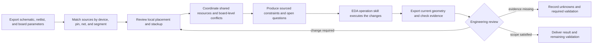

# PCB Routing Knowledge

**Evidence-backed PCB layout and routing decisions, with explicit applicability and verification.**

An EDA-independent knowledge skill for AI engineering assistants and PCB designers.

Author: **李继洲 (Li Jizhou)** · License: [MIT](LICENSE)


The primary use case is **AI-assisted PCB design**. When an AI is asked to draw or review a PCB, this skill gives it a structured engineering basis before it starts routing: professional books, standards, peer-reviewed papers, semiconductor-vendor documents, and public hardware experience are organized into traceable guidance. It is independent of any EDA product: EasyEDA, KiCad, and other EDA operation skills can consume its constraints and execute the work, while this project provides the engineering basis and review framework.

## Why this project exists

This project is for people who want to turn an idea into a real circuit board.

Many developers can use EDA software but have not yet had the chance to systematically learn return paths, stackups, impedance, power delivery, thermal design, EMC, and manufacturing. Others already have a real board to debug and need a clearer way to understand why a route, plane, or component placement matters. Being comfortable with software while still learning hardware does not prevent anyone from starting; a useful workflow should explain its reasons and keep its sources visible.

This is **李继洲's first open-source project**. It aims to make reliable public engineering material easier for an AI to use, so people who do not have time to study every hardware topic from the beginning can still ask an AI to assist with PCB layout and routing in a more traceable way. It can work together with EasyEDA or another EDA operation skill: this project organizes engineering evidence and review questions before and after routing, the EDA tool performs the edits, and the actual board still requires engineering decisions based on data, simulation, measurement, and manufacturing results.

It is not an autorouter and it is not a certification system. It avoids unconditional rules such as “always make the power trace wider” or “copy the layout whenever the design is 2.4 GHz”. Instead, it asks for the device, net, stackup, operating condition, and manufacturing context before producing a reviewable recommendation. Corrections, counterexamples, and reproducible measurements are welcome.

> **Current status:** initial research release. Source records, conditional rules, offline tools, and synthetic review scenarios are included. Real EDA integration, independent board fabrication, and full SI/PI/EMC/thermal validation are still outstanding. This project does not promise hands-off routing or automatic production approval for arbitrary boards.

## What it covers

| Area | Current scope |
| --- | --- |
| Power and drivers | High-di/dt loops, switch nodes, feedback, gate returns, Kelvin sensing, current-path review |
| Analog and EMC | Return paths, decoupling, coupling paths, sensitive analog regions, cable and interface protection |
| High-speed and RF | Stackup and impedance inputs, reference-plane changes, differential skew, via stubs, matching structures, validation conditions |
| Multilayer architecture | Stackups, reference planes, layer transitions, blind/buried vias, thermal paths, and manufacturing constraints |
| Mixed circuit domains | Digital, analog, mixed-signal, memory, common wired interfaces, RF, power, and isolation domains |
| Production preparation | DFM/DFA/DFT, manufacturing tolerances, prototype evidence, pilot builds, and test gates |
| Research evidence | Bibliographic and revision checks, reading status, page/section locations, experimental limits, and standards status |
| Offline tools | Source search, applicability screening, DC-drop lower-bound calculation, and evidence/revision checks |

Numerical values are selected only after the current project conditions and applicable source have been checked. Missing conditions remain explicit `unknown` values; the project does not invent current, stackup, thermal, or clearance assumptions. The multilayer guidance is a composition checklist, not a universal layer-stack template.

## How the workflow works



The process is independent of EDA net naming, APIs, and local directories. The consuming EDA skill maps the constraints into its own rules and geometry operations; successfully setting a rule does not prove that the geometry satisfies it. See the [integration contract](references/integration-contract.md).

For a mixed board, local rules are created first for each component, pin, net, and route segment. The board is then checked as a whole for shared PDN and return paths, reference planes, thermal spreading, RF keep-outs, isolation corridors, manufacturing, and test access. A local `pass` never automatically becomes a board-level `pass`.

Applicability is evaluated separately for frequency, protocol, device model, package, pin role, topology, and stackup. A 2.4 GHz target does not inherit LTE/4G rules, and an RF pin does not inherit the strategy of the same device's ADC, crystal, or power pin. Candidate screening is only a first filter; the exact source and board evidence still need engineering review.

## Evidence and source policy

The project keeps the chain:

**original source → applicability conditions → project input → design constraint → execution evidence → review result**

Sources are recorded with their publisher, version, URL, reading status, precise location, and limitations. A bibliographic record is not treated as a full-text reading. A paper's experiment remains the authors' evidence; it is not claimed as a measurement performed by this project.

The source set includes:

- professional books and lawful publisher excerpts;
- IPC/IEC and other standards metadata or lawful previews, with maintenance status recorded;
- IEEE and other academic papers, with peer review distinguished from technical reports;
- official semiconductor-vendor application notes, hardware guides, datasheets, and evaluation-board material;
- fixed revisions of public hardware projects and open-source EDA tooling.

The repository does not redistribute complete books, paid standards, or paper PDFs. It stores source records, original summaries, and links so that users can verify the material themselves.

## Quick start

### Main use case: AI draws the PCB

The intended call sequence is:

```text
Use $pcb-routing-knowledge to analyze the current PCB.
Read the schematic, BOM, exact devices and packages, stackup, and manufacturing limits.
Generate sourced routing constraints by component, pin, net segment, and board-level conflict.
Then call the current EDA operation skill to place, route, pour copper, and export geometry.
Finally, read back the geometry, DRC, simulation, and measurement evidence for review.
```

If the AI client does not support `$` skill syntax, ask it to read this repository's `SKILL.md` and follow the same sequence. The skill supplies routing strategy and review questions; it does not silently replace missing project facts or guarantee the result.

### For an AI or EDA workflow

1. Provide the schematic/netlist, BOM, exact device and package revisions, board revision, stackup, copper thickness, mechanical limits, operating modes, and manufacturing capability.
2. Load [`SKILL.md`](SKILL.md). The workflow selects applicable source topics, keeps missing facts as `unknown`, and creates component-level and board-level constraints.
3. Run the offline selector for a target profile when a matching catalog entry exists:

   ```sh
   python scripts/select_rules.py --profile examples/applicability/rf-2g4.json
   ```

4. Let the current EDA operation skill execute the constraints, then export the new geometry, DRC/plane evidence, and relevant simulation or measurement results for review.

### Offline tools

```sh
# Search registered sources (multiple words use AND matching)
python scripts/pcb_knowledge.py sources --query "decoupling"

# Screen a synthetic device/net profile
python scripts/select_rules.py --profile examples/applicability/rf-2g4.json

# Calculate only a uniform-trace DC voltage-drop lower bound
python scripts/pcb_knowledge.py dc-budget --current-a 2 --length-mm 100 \
  --copper-um 35 --drop-mv 100 --rho-ohm-m 1.724e-8 --width-mm 1

# Demonstrate incomplete evidence (expected exit code 1)
python scripts/pcb_knowledge.py audit --constraints examples/constraints.json \
  --review examples/review.incomplete.json
```

`dc-budget` does **not** calculate thermal ampacity and is not an IPC-2152 implementation. `audit` checks declared evidence fields and revision consistency; it does not read or authenticate the evidence and cannot replace DRC, simulation, measurement, or engineering review. All bundled examples are synthetic.

## Copyright and use boundaries

The repository contains original summaries, rule descriptions, structured source records, and necessary short quotations only. It does not include complete copyrighted books, paid standards, or paper PDFs. Books, standards, papers, application notes, hardware designs, and upstream software remain under their own copyrights and licenses; citations do not relicense them. The [MIT License](LICENSE) applies only to original material in this repository.

Use the current device documentation, applicable standards, manufacturer requirements, and project validation conditions for a real product. A source count, a clean DRC, or a completed review checklist does not by itself establish production readiness, regulatory compliance, or reliability.

## Repository layout

```text
SKILL.md                            Skill entrypoint and workflow
agents/openai.yaml                  Discovery metadata
references/topics/                  Conditional engineering rules
references/sources/                 Versioned source records and reading status
references/cases/                   Public cases and open-source project analyses
references/integration-contract.md EDA-independent interface
scripts/                            Offline search, calculation, and evidence tools
examples/                           Clearly marked synthetic examples
tests/                              Behavioral tests
.github/workflows/                  Validation workflow for future pushes
```

## Validation and contribution

```sh
python -m pip install -r requirements-dev.txt
python scripts/validate_repository.py
python scripts/build_source_map.py --check
python -m unittest discover -s tests -v
```

The current local validation includes 25 passing tests, source and link checks, schema checks, applicability examples, and a clean-copy portability run. See [`VALIDATION.md`](VALIDATION.md) for the exact scope and the remaining gaps. The CI workflow is configuration for future GitHub runs; it is not evidence that a remote run has already passed.

Please read [`CONTRIBUTING.md`](CONTRIBUTING.md) before adding a source or a board case. Prefer primary sources, record applicability and limitations, preserve licenses, and provide reproducible measurements or failure evidence when making an engineering claim.

## Author

**李继洲 (Li Jizhou)**

This is my first open-source project. The goal is to make the path from “I can use the software” to “I can reason about the real board” a little clearer, while staying honest about what still needs an experienced engineer, a simulator, a laboratory, and a manufacturer.
